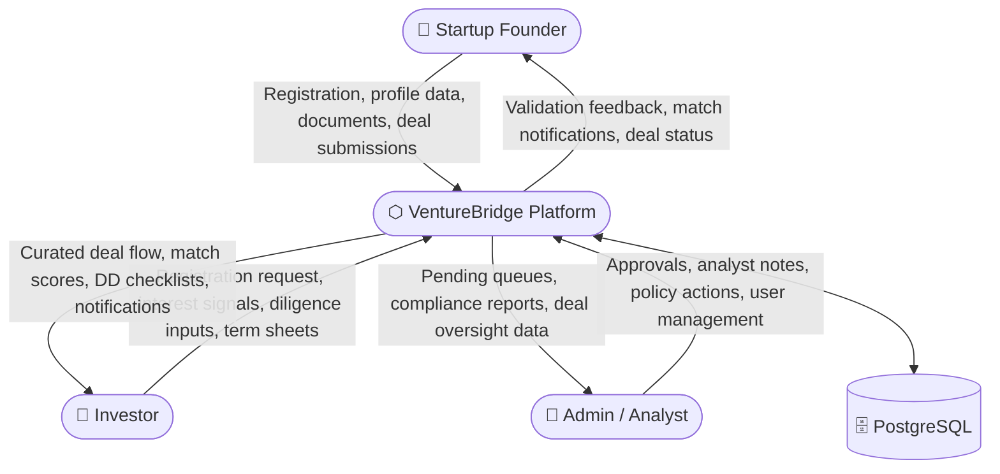
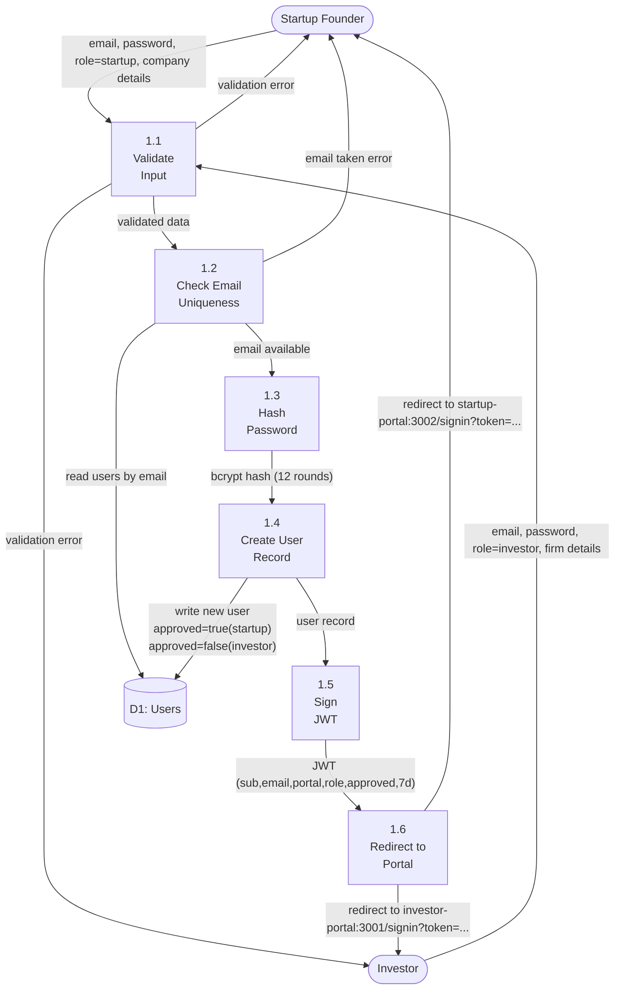
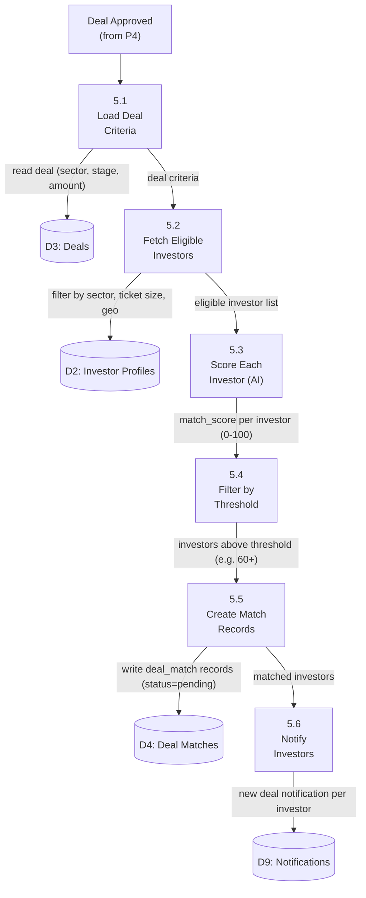

# Data Flow Diagram — VentureBridge

---

## Level 0 — Context Diagram

Shows the system as a single process with all external actors and top-level data flows.

---

## Level 1 — System Processes

Breaks down the platform into its 7 core processes and shows data flows between them, actors, and data stores.

```mermaid
flowchart TD

    %% External Entities
    SF(["👤 Startup Founder"])
    IV(["👤 Investor"])
    AD(["👤 Admin / Analyst"])

    %% Data Stores
    DS_USERS[("D1: Users")]
    DS_PROFILES[("D2: Profiles")]
    DS_DEALS[("D3: Deals")]
    DS_MATCHES[("D4: Deal Matches")]
    DS_DOCS[("D5: Documents")]
    DS_DD[("D6: Diligence Items")]
    DS_NOTES[("D7: Analyst Notes")]
    DS_TS[("D8: Term Sheets")]
    DS_NOTIF[("D9: Notifications")]

    %% Processes
    P1["1.0\nAuth &\nRegistration"]
    P2["2.0\nProfile\nManagement"]
    P3["3.0\nDeal\nSubmission"]
    P4["4.0\nAdmin Review\n& Validation"]
    P5["5.0\nInvestor\nMatching"]
    P6["6.0\nDiligence\nWorkflow"]
    P7["7.0\nTerm Sheet\n& Closure"]

    %% P1 — Auth
    SF -- "email, password, portal=startup, details" --> P1
    IV -- "email, password, portal=investor, details" --> P1
    AD -- "email, password, portal=admin" --> P1
    P1 -- "create user record" --> DS_USERS
    P1 -- "JWT token + portal redirect" --> SF
    P1 -- "JWT token + portal redirect" --> IV
    P1 -- "JWT token + portal redirect" --> AD

    %% P2 — Profile
    SF -- "company info, sector, stage, documents" --> P2
    IV -- "firm info, ticket size, sectors, geo" --> P2
    P2 -- "read/write startup profile" --> DS_PROFILES
    P2 -- "store uploaded files" --> DS_DOCS
    P2 -- "profile updated notification" --> DS_NOTIF

    %% P3 — Deal Submission
    SF -- "deal details, target amount, stage" --> P3
    P3 -- "read startup profile" --> DS_PROFILES
    P3 -- "create deal record (status=draft)" --> DS_DEALS
    P3 -- "new deal pending review notification" --> DS_NOTIF

    %% P4 — Admin Review
    AD -- "review decision, analyst notes, flags" --> P4
    P4 -- "read pending deals" --> DS_DEALS
    P4 -- "read/write analyst notes" --> DS_NOTES
    P4 -- "update deal status (approved/rejected)" --> DS_DEALS
    P4 -- "approve investor accounts" --> DS_USERS
    P4 -- "deal approved/rejected notification" --> DS_NOTIF

    %% P5 — Matching
    P4 -- "trigger matching on deal approval" --> P5
    P5 -- "read approved deals" --> DS_DEALS
    P5 -- "read investor profiles + criteria" --> DS_PROFILES
    P5 -- "write match records with scores" --> DS_MATCHES
    P5 -- "new match notification" --> DS_NOTIF
    IV -- "view curated deal flow" --> P5

    %% P6 — Diligence
    IV -- "interest signal, diligence inputs" --> P6
    AD -- "assign analyst, add checklist items" --> P6
    P6 -- "read deal match" --> DS_MATCHES
    P6 -- "read/write diligence items" --> DS_DD
    P6 -- "read documents" --> DS_DOCS
    P6 -- "write analyst notes" --> DS_NOTES
    P6 -- "update match status (in_diligence)" --> DS_MATCHES
    P6 -- "diligence update notification" --> DS_NOTIF

    %% P7 — Term Sheet & Closure
    IV -- "term sheet proposal" --> P7
    SF -- "accept / counter / reject" --> P7
    P7 -- "read deal match" --> DS_MATCHES
    P7 -- "create/update term sheet" --> DS_TS
    P7 -- "update match status (term_sheet/closed)" --> DS_MATCHES
    P7 -- "update deal status (closed)" --> DS_DEALS
    P7 -- "deal closed notification" --> DS_NOTIF
```

---

## Level 2 — Process 1: Auth & Registration (Detailed)

---

## Level 2 — Process 5: Investor Matching (Detailed)

