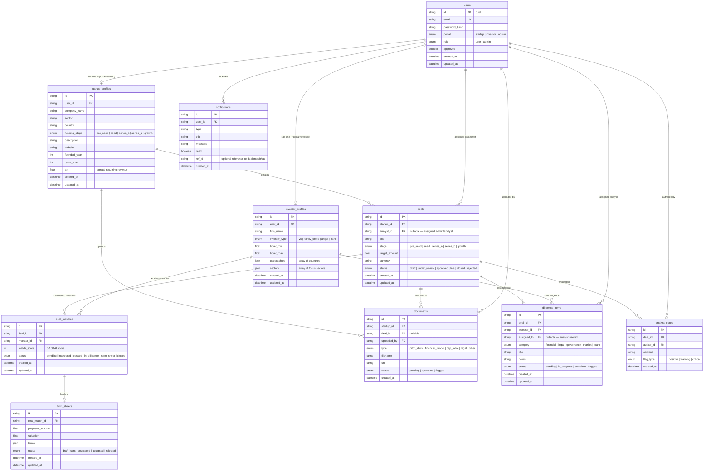

# Entity Relationship Diagram — VentureBridge

All entities, attributes, and relationships for the PostgreSQL database.

---

## Entity Descriptions

| Entity | Purpose |
|---|---|
| `users` | Single auth table for all portals. `portal` field determines role context. |
| `startup_profiles` | Extended profile for startup users — company info, sector, funding stage. |
| `investor_profiles` | Extended profile for investor users — firm, ticket size, focus areas. |
| `deals` | A live fundraising round created by a startup. Central entity for all activity. |
| `deal_matches` | Junction between deals and investors. Tracks AI match score and progression status. |
| `documents` | Files uploaded by startups (pitch decks, financials, legal docs). |
| `diligence_items` | Checklist items per deal per investor. Assigned to analysts for review. |
| `analyst_notes` | Internal notes by admin/analysts on a deal with severity flags. |
| `term_sheets` | Formal offer from investor to startup arising from a deal match. |
| `notifications` | In-app notifications for all user types on key events. |
