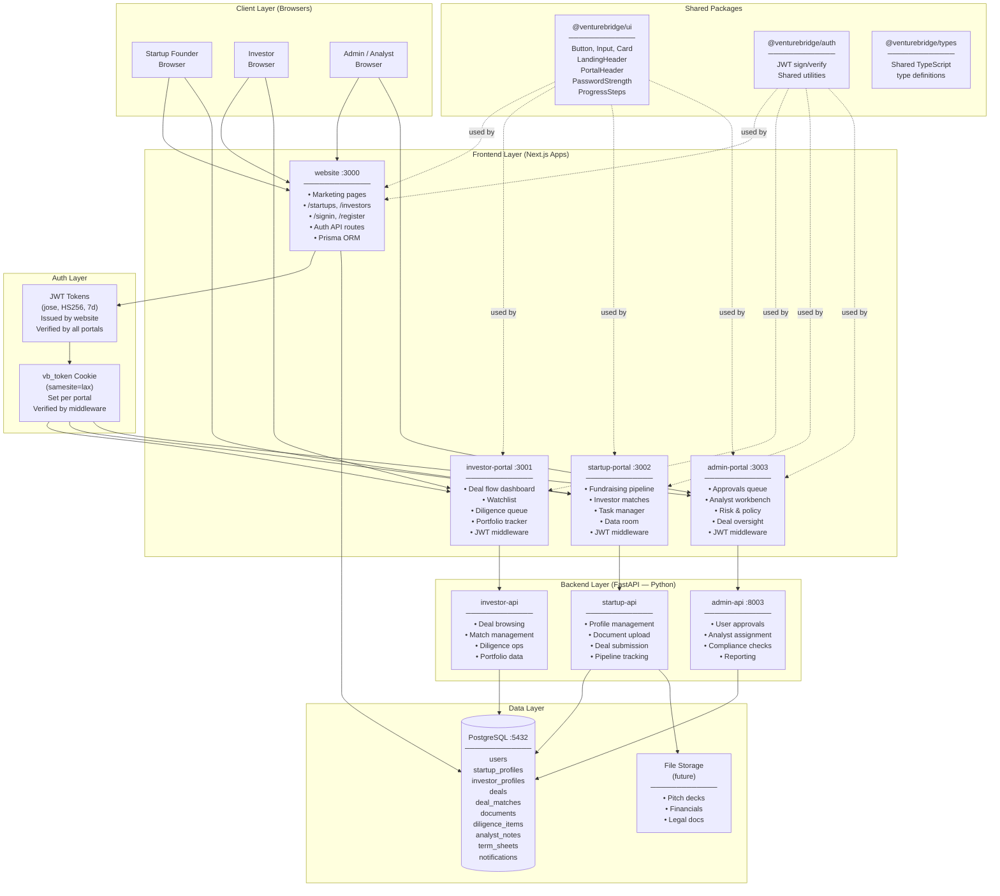
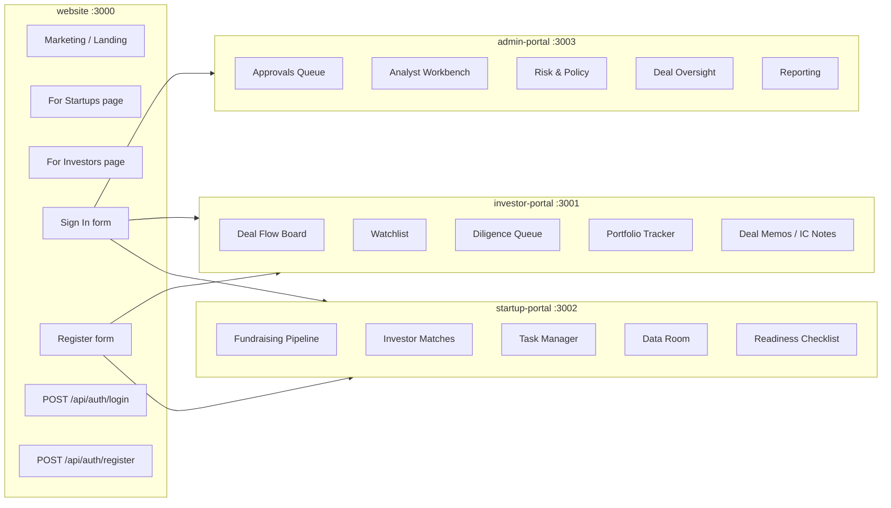
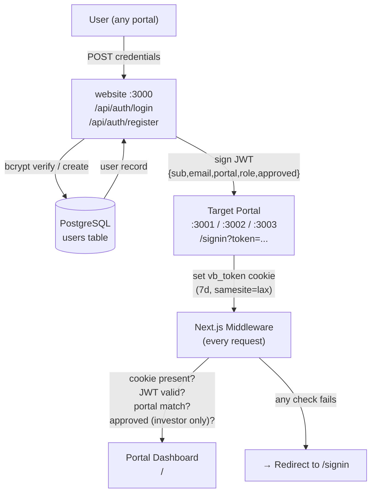
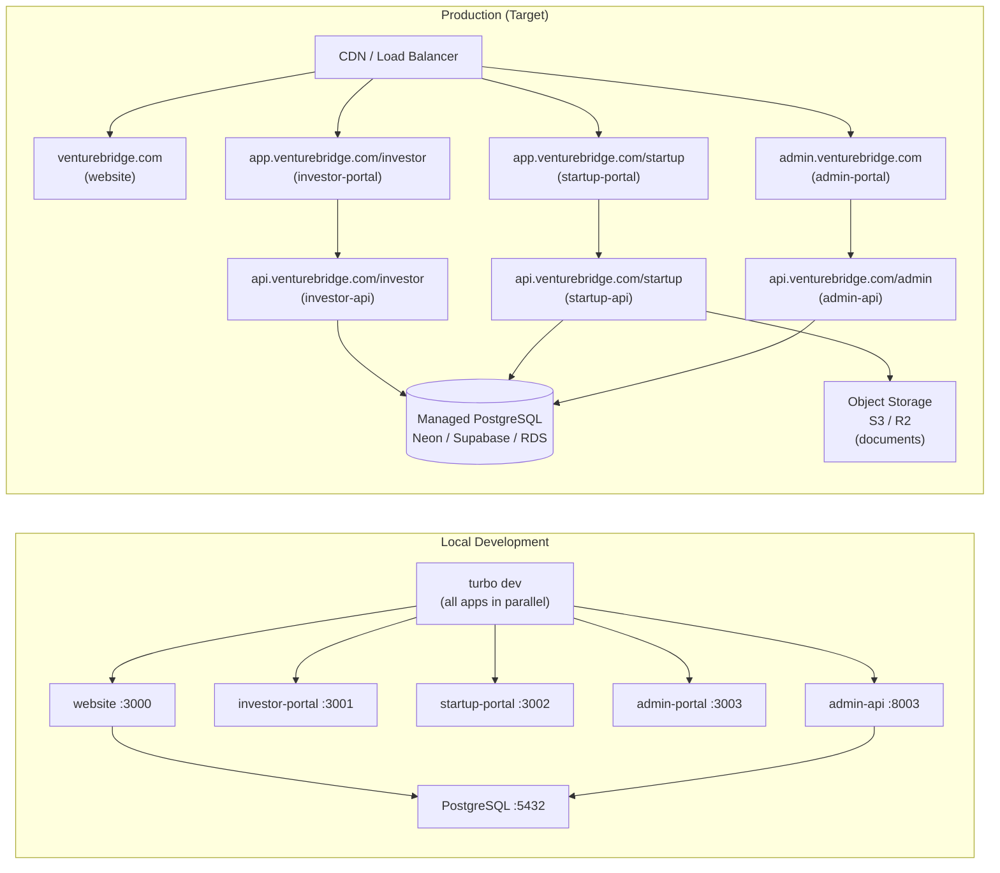

# High Level Design — VentureBridge

---

## System Architecture Overview

---

## Portal Responsibility Map

---

## Authentication Architecture

---

## Deployment Topology (Local Dev → Production)

---

## Technology Stack Summary

| Layer | Technology | Purpose |
|---|---|---|
| Monorepo | Turborepo + npm workspaces | Parallel builds, shared packages |
| Frontend | Next.js 16, React 19 | All portals and website |
| Styling | Tailwind CSS 4 | Utility-first, design tokens via `@theme` |
| Auth | jose (JWT HS256) + bcryptjs | Token signing + password hashing |
| ORM | Prisma 5 | Type-safe DB access (website only) |
| Database | PostgreSQL | Primary data store |
| Backend APIs | FastAPI (Python) | Business logic per portal |
| Shared UI | @venturebridge/ui | Cross-portal component library |
| File Storage | TBD (S3/R2) | Pitch decks, financial docs |
| Deployment | TBD (Vercel / Railway) | Hosting |
