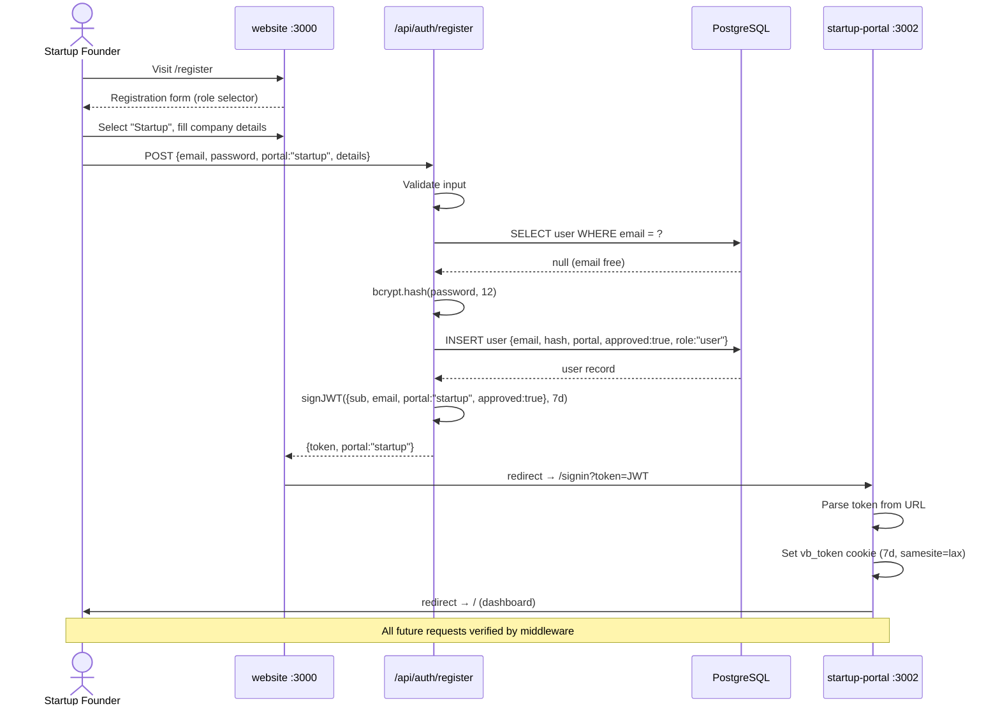
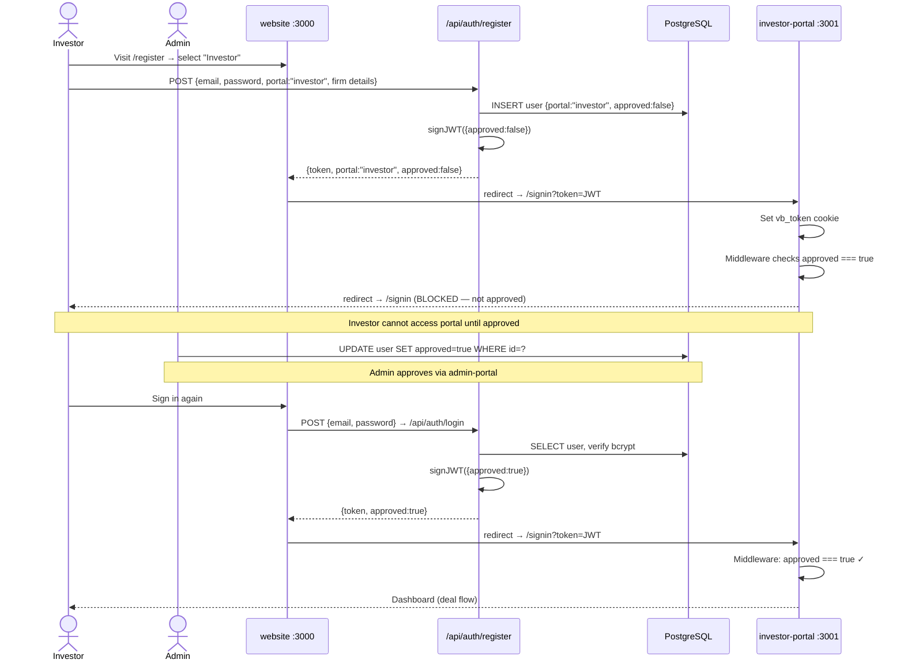
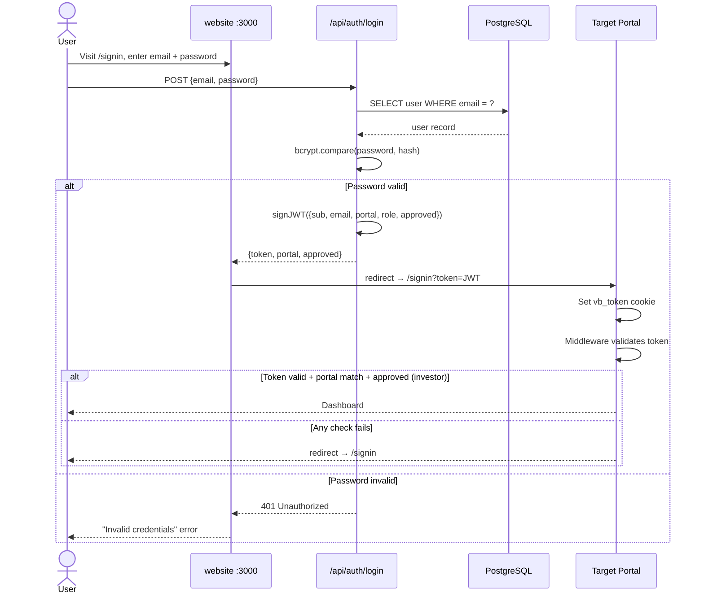
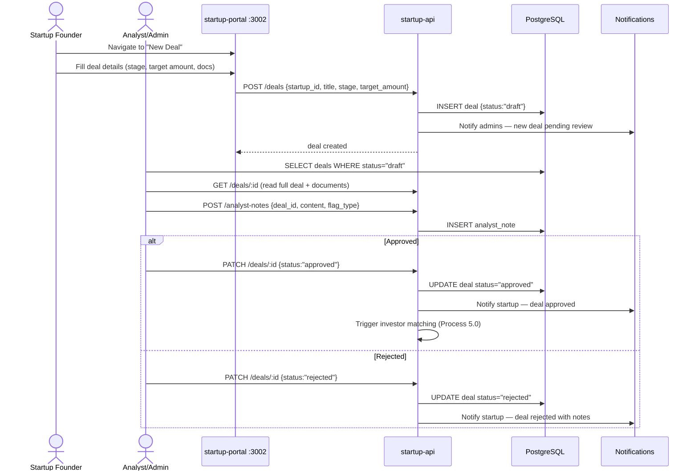
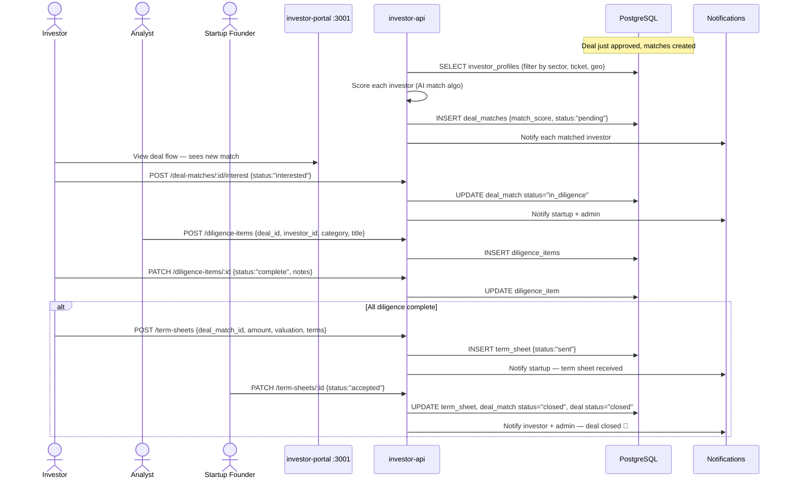
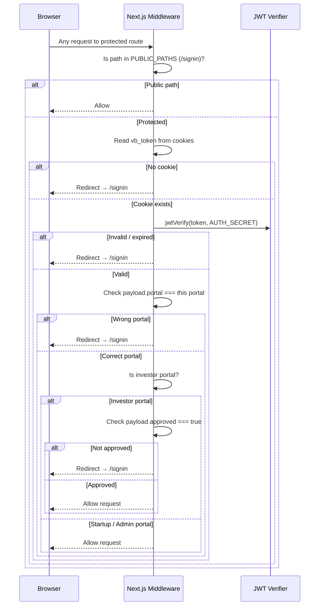

# Sequence Diagrams — VentureBridge

Key interaction flows between actors and system components.

---

## 1. Startup Registration & Portal Access

---

## 2. Investor Registration & Approval Gate

---

## 3. Sign In Flow (All Portals)

---

## 4. Deal Submission & Admin Validation

---

## 5. Investor Match → Diligence → Term Sheet

---

## 6. Middleware Auth Check (Every Request)

