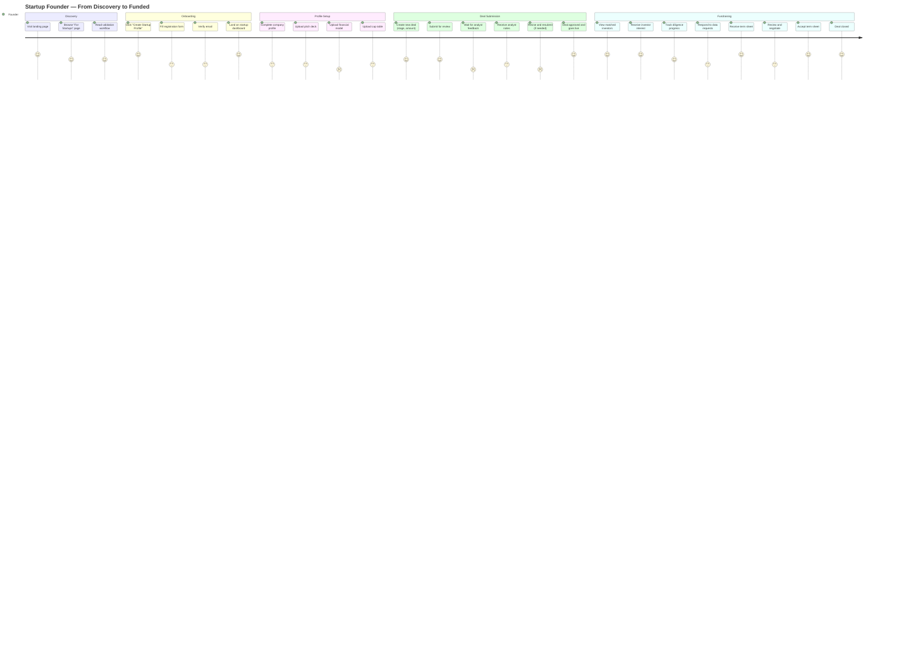
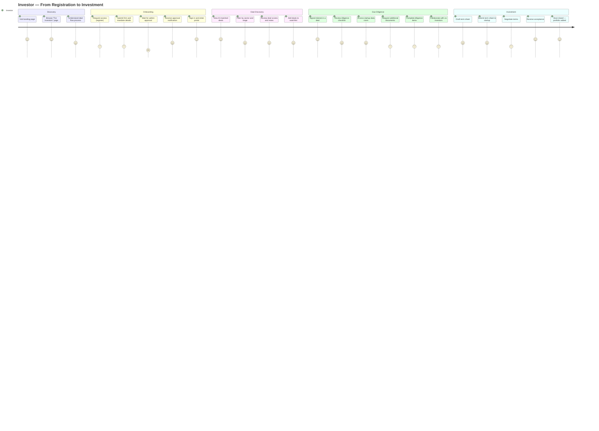
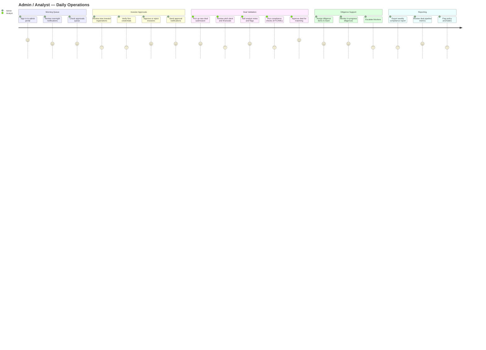
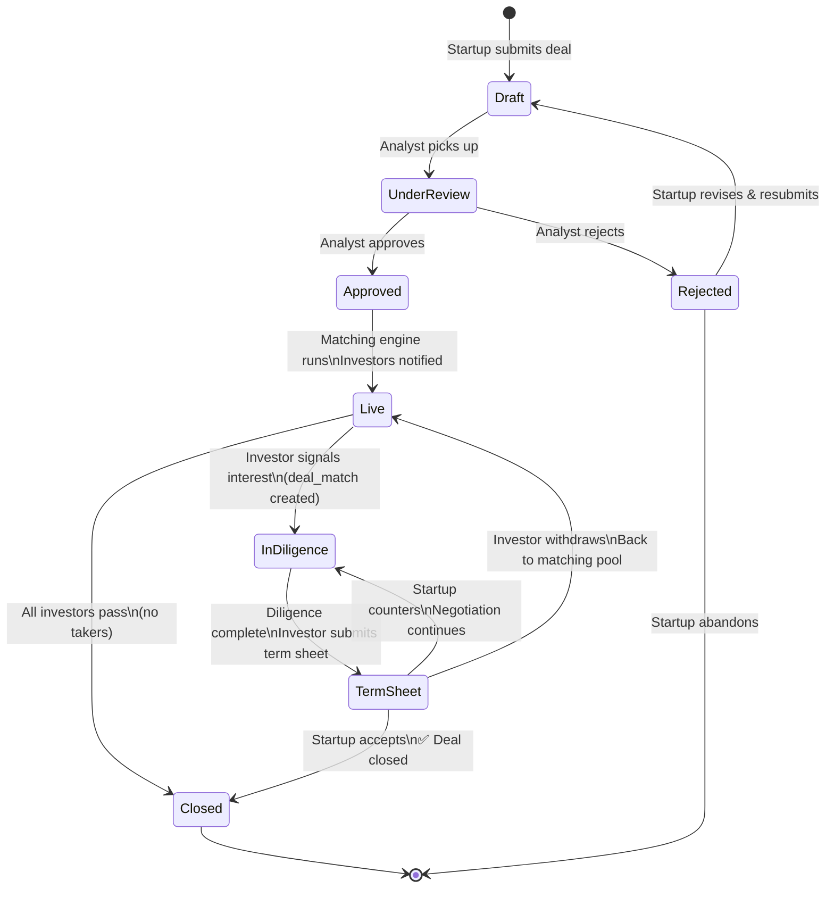

# User Journey Maps — VentureBridge

End-to-end flows for each persona from first visit to goal completion.

---

## 1. Startup Founder Journey

---

## 2. Investor Journey

---

## 3. Admin / Analyst Journey

---

## 4. Cross-Portal State Machine — Deal Lifecycle

